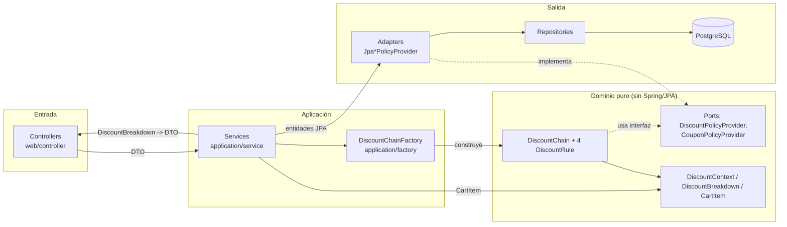
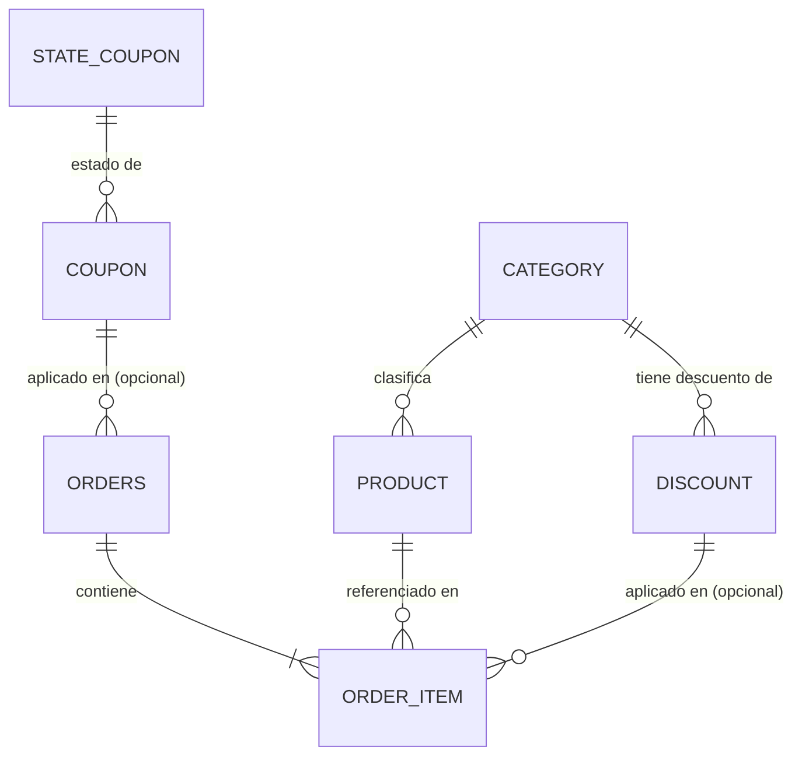
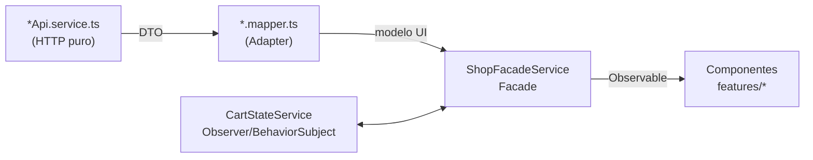

# Arquitectura — Core E-Commerce · Descuentos Acumulativos

Este documento responde, de forma justificada, a los requisitos de la sección **4.1 (Arquitectura y Criterio de Diseño)** de la prueba técnica: stack elegido, diseño de carpetas, trade-offs asumidos, aislamiento del motor de descuentos frente a persistencia/controladores, y los patrones de diseño implementados explícitamente en el código. También documenta, con el mismo nivel de detalle, el modelo de datos completo y el contrato REST/OpenAPI, para servir como referencia durante la sustentación.

## Índice

1. [Stack tecnológico y justificación](#1-stack-tecnológico-y-justificación)
2. [Diseño de carpetas](#2-diseño-de-carpetas)
3. [Arquitectura del backend (hexagonal / puertos y adaptadores)](#3-arquitectura-del-backend-hexagonal--puertos-y-adaptadores)
4. [Aislamiento del motor de descuentos](#4-aislamiento-del-motor-de-descuentos)
5. [Patrones de diseño implementados](#5-patrones-de-diseño-implementados)
6. [Modelo de datos — diccionario de datos](#6-modelo-de-datos--diccionario-de-datos)
7. [Contrato REST y OpenAPI/Swagger](#7-contrato-rest-y-openapiswagger)
8. [Arquitectura del frontend](#8-arquitectura-del-frontend)
9. [Trade-offs de arquitectura asumidos](#9-trade-offs-de-arquitectura-asumidos)
10. [Estrategia de pruebas y cobertura](#10-estrategia-de-pruebas-y-cobertura)

---

## 1. Stack tecnológico y justificación

| Capa | Elección | Por qué |
|---|---|---|
| Backend | **Spring Boot 4.1.1 / Java 17** | Framework maduro para exponer una API REST con inyección de dependencias de primera clase, lo que permite implementar Puertos y Adaptadores (hexagonal) sin librerías extra: las interfaces de dominio (`domain/port/*`) se inyectan y Spring resuelve la implementación concreta (`infrastructure/persistence/adapter/*`) por autodetección de `@Component`. Java 17 (LTS) da acceso a `record` (usado en todos los DTOs y en `CartItem`/`DiscountBreakdown`) para modelar datos inmutables sin boilerplate. |
| Persistencia | **PostgreSQL 16 + Spring Data JPA/Hibernate** | Relacional porque el dominio es intrínsecamente relacional (productos-categorías-descuentos-cupones-órdenes con integridad referencial real), y Postgres es el estándar de facto para este tipo de prueba. Spring Data JPA reduce el código repetitivo de acceso a datos a interfaces de repositorio. |
| Documentación de API | **springdoc-openapi-starter-webmvc-ui 3.1.1** | Genera el contrato OpenAPI 3 a partir de las anotaciones de Spring MVC y expone Swagger UI sin configuración manual del `openapi.json`. Ver sección 7. |
| Frontend | **Angular 22** | Exige tipado estricto de punta a punta (alineado con el requisito 4.2), tiene DI e inyección de servicios `providedIn: 'root'` que encaja naturalmente con el patrón Facade/Observer usados aquí, y su compilador (`strictTemplates`) valida los bindings de las plantillas en tiempo de build, no en runtime. |
| Estado reactivo (frontend) | **RxJS (`BehaviorSubject`) como base + Angular Signals localizados** | RxJS para todo el estado que cruza la frontera HTTP (carrito, catálogo, simulación de checkout) porque ya trae operadores (`map`, `catchError`, `switchMap`) para componer llamadas asíncronas. Signals (`computed`, `toSignal`) se usan puntualmente en el filtrado/orden del catálogo (`features/catalog/catalog.ts`) porque ese estado es 100% derivado y local a un componente — no necesita la maquinaria de un `Observable` compartido, y `computed()` da mejor ergonomía para combinar 5 filtros a la vez. Es una decisión consciente de coexistencia, no una migración a medias. |
| Build/paquetes | **Monorepo (`apps/backend` + `apps/frontend`) con Maven Wrapper y npm** | Un solo repositorio para un entregable de examen con dos aplicaciones fuertemente acopladas por el mismo contrato de negocio (el motor de descuentos) — evita la sobrecarga de coordinar versiones entre repos separados para un MVP de este alcance. `mvnw` incluido evita depender de una instalación local de Maven. |

El `pom.xml` incluye además dependencias de Kotlin (`kotlin-stdlib`, `kotlin-maven-plugin`) heredadas del scaffolding inicial de Spring Initializr; el backend es Java 17 puro, sin archivos `.kt`.

## 2. Diseño de carpetas

### 2.1 Monorepo

```
examen-ecommerce/
├── apps/
│   ├── backend/      # API REST — Spring Boot 4 / Java 17
│   └── frontend/     # SPA — Angular 22
├── docs/
│   ├── arquitectura.md   # este documento
│   └── ia.md             # gobernanza y bitácora de uso de IA
├── docker-compose.yml     # PostgreSQL 16 para desarrollo local
├── .env.example
└── README.md
```

### 2.2 Backend — arquitectura hexagonal por paquete

```
org.ecommerce.backend
├── domain/                     # Núcleo de negocio. CERO dependencias de Spring/JPA/Lombok.
│   ├── discount/                #   Motor de descuentos (Chain of Responsibility)
│   │   ├── DiscountRule.java           interfaz del "eslabón" de la cadena
│   │   ├── DiscountChain.java          orquesta la ejecución secuencial
│   │   ├── CategoryDiscountRule.java   regla 1: 10% Tecnología
│   │   ├── VolumeDiscountRule.java     regla 2: 5% si subtotal > 100
│   │   ├── CouponDiscountRule.java     regla 3: % del cupón
│   │   └── DiscountCapRule.java        regla 4: tope 35%
│   ├── model/                   #   Objetos de dominio puros
│   │   ├── CartItem.java, CategoryType.java, DiscountContext.java, DiscountBreakdown.java
│   │   └── (records e invariantes validados en el constructor compacto)
│   ├── port/                    #   Interfaces que el dominio necesita pero no implementa
│   │   ├── DiscountPolicyProvider.java   "dame el % activo de una categoría"
│   │   └── CouponPolicyProvider.java     "dame el % de un cupón válido"
│   └── exception/               #   Excepciones de negocio (EmptyCart, InsufficientStock, InvalidCoupon, ProductNotFound)
├── application/                 # Casos de uso: orquestan dominio + infraestructura
│   ├── factory/DiscountChainFactory.java     construye la cadena (Factory Method)
│   └── service/
│       ├── CheckoutService.java        caso de uso "comprar" y "simular"
│       ├── CouponQueryService.java     caso de uso "validar cupón"
│       └── ProductQueryService.java    caso de uso "listar catálogo"
├── infrastructure/persistence/  # Adaptadores de salida (implementan los `port`)
│   ├── entity/                  #   7 entidades JPA (sección 6)
│   ├── repository/              #   Spring Data JpaRepository por entidad
│   └── adapter/
│       ├── JpaDiscountPolicyProvider.java   implementa DiscountPolicyProvider con Hibernate
│       └── JpaCouponPolicyProvider.java     implementa CouponPolicyProvider con Hibernate
└── web/                          # Adaptador de entrada (HTTP)
    ├── controller/               #   CheckoutController, CouponController, ProductController
    ├── dto/                      #   records de request/response — nunca se exponen entidades JPA
    ├── config/OpenApiConfig.java
    └── exception/GlobalExceptionHandler.java  (@RestControllerAdvice)
```

La regla de dependencia es estricta y de una sola dirección: `web` y `infrastructure` dependen de `domain` (a través de `application`), nunca al revés. `domain/` no importa nada de `org.springframework.*`, `jakarta.persistence.*` ni Lombok — es Java plano. Esto es lo que en la práctica se conoce como **arquitectura hexagonal (Puertos y Adaptadores)**: el dominio define los puertos (`DiscountPolicyProvider`, `CouponPolicyProvider`) como interfaces; la infraestructura los implementa como adaptadores.

### 2.3 Frontend — `core` / `shared` / `features`

```
src/app/
├── core/                         # Todo lo que NO es visual: contratos, estado, HTTP
│   ├── models/
│   │   ├── api/                  #   *.dto.ts — forma EXACTA de lo que manda el backend
│   │   ├── product.model.ts, discount-breakdown.model.ts, coupon-validation.model.ts
│   ├── mappers/                  #   DTO -> modelo de UI (Adapter). Un mapper por dominio.
│   └── services/
│       ├── product-api.service.ts, checkout-api.service.ts, coupon-api.service.ts   (HTTP puro)
│       ├── cart-state.service.ts        (Observer — estado del carrito)
│       └── shop-facade.service.ts       (Facade — único punto de entrada para los componentes)
├── shared/                       # Componentes reutilizables sin lógica de negocio propia
│   └── discount-alert/           #   HU4: alerta visual del tope del 35%
└── features/                     # Componentes de pantalla, uno por vista
    ├── catalog/                  #   Catálogo + filtros + orden (Signals locales)
    ├── cart/                     #   Drawer del carrito (HU1)
    └── checkout/                 #   Vista de checkout con cupón (HU2)
```

Cobertura de pruebas (`angular.json` → `coverageInclude`) está acotada a `core/**` y `shared/**` — exactamente el alcance que exige 4.3 ("manejo de estado del carrito, validación visual de alertas"). `features/**` queda fuera a propósito: son componentes de presentación (plantillas + wiring a la fachada), no lógica de negocio.

## 3. Arquitectura del backend (hexagonal / puertos y adaptadores)



Flujo de una compra (`POST /api/checkout`):

1. `CheckoutController` recibe `CheckoutRequest` (DTO) y delega en `CheckoutService.checkout(...)`.
2. `CheckoutService` bloquea cada producto (`findWithLockById`, ver 9.2), valida stock, y traduce las entidades `Product` a objetos de dominio `CartItem` (dominio puro).
3. Se crea un `DiscountContext` con esos `CartItem` y se le pide a `DiscountChainFactory` la cadena de reglas.
4. `DiscountChain.execute(context)` corre las 4 reglas en orden fijo; cada regla lee/escribe el `DiscountContext` sin saber nada de Postgres, HTTP ni de las demás reglas.
5. El resultado (`DiscountBreakdown`, inmutable) se usa para construir y persistir la `Order` + `OrderItem[]` (snapshot), y se traduce a `CheckoutResponse` (DTO) para el cliente.

## 4. Aislamiento del motor de descuentos

Pregunta explícita del enunciado: *"¿Cómo aisló las reglas matemáticas del motor de descuentos de los detalles de persistencia y controladores de la API?"*

1. **Ubicación**: las 4 reglas y su orquestador viven en `domain/discount/`, y su acumulador de estado (`DiscountContext`) en `domain/model/` — ningún archivo de ese paquete importa `org.springframework.*`, `jakarta.persistence.*` ni Lombok (el propio Javadoc de `DiscountContext` lo deja explícito: *"Deliberadamente sin Lombok/Spring/JPA: es dominio puro"*).
2. **Entrada de datos**: las reglas nunca ven una entidad `Product` de JPA. Reciben `CartItem`, un `record` de dominio con sus propias invariantes (`unitPrice >= 0`, `quantity > 0` validadas en el constructor compacto). La traducción `Product` (JPA) → `CartItem` (dominio) ocurre una sola vez, en `CheckoutService.toCartItem(...)` — la capa de aplicación es la frontera.
3. **Dependencias externas invertidas (DIP)**: `CategoryDiscountRule` y `CouponDiscountRule` necesitan datos que viven en la base (el % de descuento de una categoría, la validez de un cupón), pero no hablan con `DiscountRepository`/`CouponRepository` directamente — dependen de las interfaces `DiscountPolicyProvider`/`CouponPolicyProvider` (puertos), implementadas fuera del dominio por `JpaDiscountPolicyProvider`/`JpaCouponPolicyProvider` (adaptadores, en `infrastructure/persistence/adapter/`). El dominio define el contrato; la infraestructura lo cumple.
4. **Parámetros externalizados, no hardcodeados**: el umbral de volumen ($100), el % de volumen (5%) y el tope (35%) vienen de `application.yml` (`discount.volume.threshold`, `discount.volume.percentage`, `discount.cap.percentage`) inyectados vía `@Value` únicamente en `DiscountChainFactory` — las reglas los reciben ya resueltos en su constructor, sin acoplarse a Spring `@Value` ellas mismas.
5. **Salida de datos**: el resultado es `DiscountBreakdown`, otro `record` de dominio inmutable. `CheckoutController` nunca ve un `DiscountBreakdown` directamente — `CheckoutService` lo traduce a `CheckoutResponse` (DTO web). Las entidades JPA (`Order`, `OrderItem`) tampoco se exponen nunca por HTTP.
6. **Consecuencia práctica y verificable**: todo `domain/discount/*` y `domain/model/*` se testea con JUnit puro, sin `@SpringBootTest`, sin base de datos ni mocks de infraestructura — la aritmética del motor de descuentos se verifica en microsegundos y de forma 100% determinística (ver sección 10).

## 5. Patrones de diseño implementados

El enunciado pide al menos dos, documentados y visibles en el código. Se implementaron los siguientes:

### 5.1 Backend

| Patrón | Dónde | Rol |
|---|---|---|
| **Chain of Responsibility** | `domain/discount/DiscountRule.java` (interfaz), `DiscountChain.java` (orquestador), `CategoryDiscountRule`, `VolumeDiscountRule`, `CouponDiscountRule`, `DiscountCapRule` | Cada regla es un eslabón que recibe el `DiscountContext` compartido, aplica su cálculo y lo deja listo para el siguiente. A diferencia del Chain of Responsibility "clásico" (que corta la cadena cuando un eslabón resuelve la petición), aquí **todos** los eslabones se ejecutan siempre en el mismo orden fijo — es una variante de acumulación, apropiada porque el enunciado exige que los descuentos se apliquen **secuencialmente y en cascada**, no que compitan entre sí. |
| **Factory Method** | `application/factory/DiscountChainFactory.java` | Único punto que sabe el orden correcto de las reglas y con qué parámetros se instancian (`categoría → volumen → cupón → tope`). Si mañana se agrega una quinta regla, se toca un solo archivo y ningún consumidor de `DiscountChain` se entera del cambio. |
| **Puertos y Adaptadores (Hexagonal) / Dependency Inversion** | `domain/port/{DiscountPolicyProvider, CouponPolicyProvider}` (puertos) implementados por `infrastructure/persistence/adapter/{JpaDiscountPolicyProvider, JpaCouponPolicyProvider}` (adaptadores) | El dominio depende de una abstracción propia, no de Spring Data JPA. Los adaptadores traducen entidades (`Coupon`, `Discount`) al vocabulario que el dominio entiende (`Optional<BigDecimal>`) — es, en esencia, también un **Adapter** de persistencia. |

### 5.2 Frontend

| Patrón | Dónde | Rol |
|---|---|---|
| **Facade** | `core/services/shop-facade.service.ts` (`ShopFacadeService`) | Único servicio que los componentes de `features/*` inyectan. Por dentro coordina `ProductApiService`, `CheckoutApiService`, `CouponApiService` y `CartStateService`, más el estado de navegación (vista activa, drawer del carrito). Ningún componente conoce ni inyecta esos 4 servicios por separado — reduce el acoplamiento y centraliza el flujo de negocio (agregar al carrito, ir a pagar, simular, confirmar). |
| **Observer** | `core/services/cart-state.service.ts` (`CartStateService`) | El carrito es un `BehaviorSubject` (el sujeto observable); cualquier componente suscrito a `lines$` / `subtotal$` / `itemCount$` (los observadores) se entera y re-renderiza automáticamente cuando el carrito cambia, sin que `CartStateService` sepa quién lo escucha. |
| **Adapter** | `core/mappers/{product,checkout,coupon}.mapper.ts` | Traducen los DTOs crudos del backend (`core/models/api/*.dto.ts`, con la forma EXACTA que manda Java) a los modelos de UI (`core/models/*.model.ts`) que consumen los componentes. Si el backend cambia el nombre de un campo, el mapper es el único lugar que se entera primero — los componentes nunca ven un DTO. |

## 6. Modelo de datos — diccionario de datos

`spring.jpa.hibernate.ddl-auto: update` genera el esquema a partir de las entidades JPA (ver trade-off en sección 9). No hay migraciones versionadas (Flyway/Liquibase); las 7 tablas siguientes son las que Hibernate crea.

### 6.1 Diagrama entidad-relación



### 6.2 Tablas

**`category`**

| Columna | Tipo | Constraints | Notas |
|---|---|---|---|
| `id` | `bigint` | PK, identity | |
| `name` | `varchar` | `NOT NULL`, `UNIQUE` | `'Tecnologia'`, `'Hogar'` (seed) |

**`state_coupon`** — catálogo de estados de cupón (tabla, no enum, para poder agregar/editar estados sin desplegar código)

| Columna | Tipo | Constraints | Notas |
|---|---|---|---|
| `id` | `bigint` | PK, identity | |
| `name` | `varchar` | `NOT NULL`, `UNIQUE` | `'ACTIVO'`, `'EXPIRADO'`, `'USADO'` (seed) |

**`coupon`**

| Columna | Tipo | Constraints | Notas |
|---|---|---|---|
| `id` | `bigint` | PK, identity | |
| `code` | `varchar` | `NOT NULL`, `UNIQUE` | ej. `WELCOME2026` |
| `discount_percentage` | `numeric(5,4)` | `NOT NULL` | fracción, ej. `0.1500` = 15% |
| `expires_at` | `timestamp` | `NOT NULL` | |
| `id_state` | `bigint` | FK → `state_coupon.id`, `NOT NULL` | |

**`discount`** — descuento por categoría (vive en BD, no en config, porque es dato de negocio escalable)

| Columna | Tipo | Constraints | Notas |
|---|---|---|---|
| `id` | `bigint` | PK, identity | |
| `category_id` | `bigint` | FK → `category.id`, `NOT NULL` | |
| `percentage` | `numeric(5,4)` | `NOT NULL` | ej. `0.1000` = 10% |
| `valid_from` | `timestamp` | nullable | `NULL` = sin fecha de inicio |
| `valid_to` | `timestamp` | nullable | `NULL` = sin vencimiento |
| `active` | `boolean` | `NOT NULL` | |

**`product`**

| Columna | Tipo | Constraints | Notas |
|---|---|---|---|
| `id` | `bigint` | PK, identity | |
| `name` | `varchar` | `NOT NULL` | |
| `unit_price` | `numeric(19,2)` | `NOT NULL` | |
| `stock` | `integer` | `NOT NULL` | decrementado atómicamente vía `SELECT ... FOR UPDATE` (sección 9.2) |
| `id_category` | `bigint` | FK → `category.id`, `NOT NULL` | |
| `image_url` | `varchar` | nullable | fallback en el frontend si es `null` |

**`orders`** — nombre plural porque `ORDER` es palabra reservada en SQL

| Columna | Tipo | Constraints | Notas |
|---|---|---|---|
| `id` | `bigint` | PK, identity | |
| `created_at` | `timestamp` | `NOT NULL` | |
| `id_coupon` | `bigint` | FK → `coupon.id`, nullable | `NULL` si la compra no usó cupón |
| `subtotal_original` | `numeric(19,2)` | `NOT NULL` | suma de `line_subtotal` de sus ítems |
| `category_discount_amount` | `numeric(19,2)` | `NOT NULL` | monto (no %) descontado por categoría |
| `volume_discount_amount` | `numeric(19,2)` | `NOT NULL` | monto descontado por volumen |
| `coupon_discount_amount` | `numeric(19,2)` | `NOT NULL` | monto descontado por cupón |
| `discount_cap_applied` | `boolean` | `NOT NULL` | `true` si el 35% recortó el descuento crudo |
| `total_discount_amount` | `numeric(19,2)` | `NOT NULL` | monto final ya topado |
| `effective_discount_percentage` | `numeric(5,4)` | `NOT NULL` | `total_discount_amount / subtotal_original`, redondeo `HALF_UP` a 4 decimales |
| `total_to_pay` | `numeric(19,2)` | `NOT NULL` | `subtotal_original - total_discount_amount` |

**`order_item`** — línea de orden con snapshot (independiente de que `product`/`discount` cambien después)

| Columna | Tipo | Constraints | Notas |
|---|---|---|---|
| `id` | `bigint` | PK, identity | |
| `order_id` | `bigint` | FK → `orders.id`, `NOT NULL` | `CascadeType.ALL` + `orphanRemoval` desde `Order` |
| `product_id` | `bigint` | FK → `product.id`, `NOT NULL` | referencia viva al producto |
| `product_name_snapshot` | `varchar` | `NOT NULL` | copia del nombre al momento de la compra |
| `unit_price_snapshot` | `numeric(19,2)` | `NOT NULL` | copia del precio al momento de la compra |
| `category_snapshot` | `varchar` | `NOT NULL`, enum (`TECNOLOGIA`/`OTRO`) | congelado, independiente de `category` |
| `quantity` | `integer` | `NOT NULL` | |
| `line_subtotal` | `numeric(19,2)` | `NOT NULL` | `unit_price_snapshot * quantity` |
| `discount_id` | `bigint` | FK → `discount.id`, nullable | `NULL` si la línea no tuvo descuento de categoría |
| `line_discount_amount` | `numeric(19,2)` | `NOT NULL` | actualmente siempre `0.00`; el desglose de descuento se persiste a nivel de orden, no prorrateado por línea |

### 6.3 Datos precargados (`data.sql`, idempotente vía `ON CONFLICT DO NOTHING` / `NOT EXISTS`)

- Categorías: `Tecnologia` (10% de descuento activo, sin vencimiento), `Hogar` (sin descuento de categoría).
- Cupones: `WELCOME2026` (15%, `ACTIVO`, vence 2027-12-31 — el que exige el enunciado) y `PROMO2020` (30%, `ACTIVO`, vence 2027-12-31 — suficiente para superar el tope del 35% en un carrito 100% Tecnología por encima de $100, dado que `WELCOME2026` solo nunca lo alcanza).
- 6 productos: Laptop X1 ($150, stock 10), Mouse Inalámbrico ($50, stock 20), Teclado Mecánico ($80, stock 15), Monitor 24" ($120, stock 8) — todos Tecnología —, Silla de Oficina ($90, stock 5) y Lámpara de Escritorio ($25, stock 1) — Hogar.

## 7. Contrato REST y OpenAPI/Swagger

Documentación interactiva generada con **springdoc-openapi-starter-webmvc-ui 3.1.1** (`web/config/OpenApiConfig.java` personaliza título, descripción y versión). Con el backend corriendo:

- Swagger UI: `http://localhost:8080/swagger-ui/index.html`
- Spec OpenAPI cruda: `http://localhost:8080/v3/api-docs`

| Método | Endpoint | Request | Response | Códigos |
|---|---|---|---|---|
| `GET` | `/api/products` | — | `ProductResponse[]` | `200` |
| `GET` | `/api/coupons/{code}` | path `code` | `CouponValidationResponse` | `200` (siempre — `valid:false` si no aplica, nunca 404, para poder usarse como validación "en vivo") |
| `POST` | `/api/checkout/simulate` | `CheckoutRequest` | `CheckoutResponse` (`orderId: null`) | `200` — solo lectura, no toca stock ni cupón |
| `POST` | `/api/checkout` | `CheckoutRequest` | `CheckoutResponse` | `201` — decrementa stock, marca cupón `USADO`, persiste `Order` |

DTOs (todos `record` de Java, en `web/dto/`):

```
CheckoutItemRequest(Long productId, Integer quantity)
CheckoutRequest(List<CheckoutItemRequest> items, String couponCode)
CheckoutResponse(Long orderId, BigDecimal subtotalOriginal, BigDecimal categoryDiscountAmount,
                  BigDecimal volumeDiscountAmount, BigDecimal couponDiscountAmount,
                  boolean discountCapApplied, BigDecimal totalDiscountAmount,
                  BigDecimal effectiveDiscountPercentage, BigDecimal totalToPay)
CouponValidationResponse(String code, boolean valid, BigDecimal discountPercentage)
ProductResponse(Long id, String name, BigDecimal unitPrice, Integer stock, String categoryName, String imageUrl)
ApiError(LocalDateTime timestamp, int status, String error, String message)
```

Manejo de errores centralizado en `GlobalExceptionHandler` (`@RestControllerAdvice`), que traduce cada excepción de dominio a un `ApiError` + código HTTP:

| Excepción de dominio | HTTP |
|---|---|
| `EmptyCartException` | `400 Bad Request` |
| `InvalidCouponException` | `400 Bad Request` |
| `IllegalArgumentException` (ej. carrito nulo) | `400 Bad Request` |
| `ProductNotFoundException` | `404 Not Found` |
| `InsufficientStockException` | `409 Conflict` |
| Cualquier otra `Exception` | `500 Internal Server Error` (mensaje genérico, no filtra detalles internos) |

Los controladores nunca reciben ni devuelven entidades JPA — solo DTOs (`record`), lo que mantiene el contrato de la API desacoplado del modelo de persistencia (parte de la respuesta a 4.2, "contratos limpios para el envío y respuesta del carrito").

## 8. Arquitectura del frontend

### 8.1 Flujo de datos end-to-end



### 8.2 Componentes

| Componente | Responsabilidad |
|---|---|
| `App` (`app.ts`/`app.html`) | Shell: topbar (título, botón de inicio, ícono de carrito con badge), enrutamiento manual catálogo↔checkout vía `view$`, monta `DiscountAlert` y `Cart` siempre visibles. |
| `Catalog` (`features/catalog`) | Grilla de productos + buscador + checklist de categorías + rango de precio + orden por precio. 100% client-side sobre Signals (`computed`) derivadas de `products$`/`cartLines$` convertidos con `toSignal`. |
| `Cart` (`features/cart`) | Drawer lateral con las líneas del carrito y el subtotal **sin** descuentos (HU1), incrementar/decrementar/eliminar, botón "Ir a pagar". |
| `Checkout` (`features/checkout`) | Vista con el desglose de descuentos en vivo (`simulate()`), campo de cupón con validación explícita (botón "Validar", no reactiva por tecla — evita que el campo se use como oráculo para adivinar códigos), y botón "Pagar" que confirma la compra real. |
| `DiscountAlert` (`shared/discount-alert`) | HU4: alerta visual persistente (no se auto-oculta) cuando `checkoutResult().discountCapApplied === true`. |

### 8.3 Servicios (`core/`)

`ProductApiService`, `CheckoutApiService`, `CouponApiService` son HTTP puro (un método por endpoint, sin lógica ni estado). `CartStateService` mantiene el estado del carrito como `BehaviorSubject<CartLine[]>` con las reglas locales (no exceder stock visible). `ShopFacadeService` es el Facade descrito en 5.2: expone `products$`, `cartLines$`, `subtotal$`, `itemCount$`, `view$`, `cartOpen$`, `simulation$`, `checkoutResult$`, `loading$`, `error$` como el único contrato que ven los componentes.

## 9. Trade-offs de arquitectura asumidos

1. **`ddl-auto: update` en vez de migraciones versionadas (Flyway/Liquibase)** — velocidad de entrega para el alcance de un examen vs. trazabilidad de esquema en un entorno real. Documentado explícitamente como "no apto para producción" en el propio `README.md`.
2. **Bloqueo pessimista (`@Lock(PESSIMISTIC_WRITE)` en `ProductRepository.findWithLockById`) en vez de bloqueo optimista (`@Version`)** — prioriza corrección estricta bajo concurrencia (dos compras simultáneas del último ítem en stock no pueden ambas tener éxito) sobre throughput; aceptable porque el checkout es una transacción corta y el catálogo es pequeño. Un `@Version` habría dado mejor escalabilidad a costa de manejar reintentos ante `OptimisticLockException` en el cliente.
3. **BigDecimal sin `.setScale()` intermedio dentro del motor de descuentos** — las 4 reglas (`domain/discount/*`) preservan precisión completa internamente (ej. `192.375`, no `192.38`); solo el `CurrencyPipe` de Angular redondea cada campo a 2 decimales **para mostrarlo**. Precisión interna máxima vs. que la suma de los montos *mostrados* pueda diferir del total *mostrado* por un centavo — trade-off deliberado (evita compounding de error de redondeo en cada paso, práctica común en motores financieros).
4. **Carrito 100% client-side, descuentos siempre recalculados contra el backend** — el subtotal del drawer (HU1) es aritmética pura en `CartStateService` (sin round-trip HTTP), pero el desglose con descuentos nunca se calcula en el frontend: se pide a `POST /api/checkout/simulate` cada vez. Menos trabajo duplicado y una sola fuente de verdad para la aritmética de negocio, a costa de una llamada HTTP adicional por cada cambio de cupón.
5. **RxJS + Signals coexistiendo** (ver sección 1) — se aceptó introducir un segundo paradigma reactivo en un único componente (`Catalog`) en vez de forzar todo a RxJS, priorizando la ergonomía de `computed()` para 5 filtros combinados sobre la consistencia estilística total del código base.
6. **Monorepo de un solo repositorio Git** — simplicidad de entrega y de historial de commits único frente a la posibilidad de versionar backend/frontend de forma independiente.

## 10. Estrategia de pruebas y cobertura

### 10.1 Backend — JUnit 5 + JaCoCo

`pom.xml` configura el plugin `jacoco-maven-plugin` con un *check* atado a la fase `verify` (`./mvnw verify` falla el build si no se cumple):

```
regla: BUNDLE / LINE / COVEREDRATIO >= 0.80
excluye de la medición: BackendApplication, web/dto/**, web/controller/**, web/config/**,
                        web/exception/**, infrastructure/persistence/entity/**,
                        infrastructure/persistence/repository/**,
                        infrastructure/persistence/adapter/**, application/factory/**
```

Es decir, la cobertura exigida se mide exactamente sobre lo que pide 4.3: el motor de descuentos (`domain/discount/*`, `domain/model/*`) y la lógica de aplicación (`CheckoutService`, `CouponQueryService`, `ProductQueryService`) — no sobre boilerplate (getters de entidades, interfaces de repositorio, DTOs, configuración).

Casos de borde cubiertos explícitamente por archivo de test:

- `DiscountCapRuleTest` — límite exacto del 35% (descuento crudo igual al tope no lo activa; un centavo más sí).
- `DiscountContextTest` / `CartItemTest` — carrito vacío (`IllegalArgumentException`), `unitPrice`/`quantity` inválidos.
- `CouponDiscountRuleTest`, `JpaCouponPolicyProviderTest` — cupón inexistente, expirado y en estado no activo (bloqueado / usado); `CouponDiscountRule` traduce cualquiera de esos a `InvalidCouponException`.
- `CheckoutServiceTest` — intento de compra con stock insuficiente (`InsufficientStockException`).
- `CategoryDiscountRuleTest`, `VolumeDiscountRuleTest` — umbral exacto de $100 (no dispara con `<=`), ítems mixtos Tecnología/Hogar.

### 10.2 Frontend — Vitest (`@angular/build:unit-test`)

`angular.json` acota la cobertura medida a `core/**` y `shared/**` (excluyendo `core/models/**`, que son solo interfaces sin lógica), dejando fuera `features/**` (componentes de presentación). Estado actual: **67 tests en 13 archivos, todos en verde**; sobre el alcance medido, **94.24% de líneas, 94.67% de sentencias, 92.75% de ramas y 88.23% de funciones** (los componentes de `features/**` igual tienen tests —carrito, catálogo, checkout, alerta— pero no cuentan para el gate de cobertura).

Comandos:

```bash
# Backend
cd apps/backend && ./mvnw verify   # reporte HTML en target/site/jacoco/index.html

# Frontend
cd apps/frontend && npx ng test --watch=false --coverage
```


